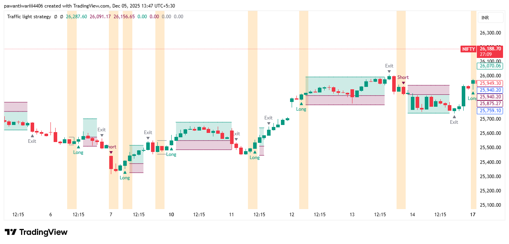

# Tradingview-Pinescript-indicators-strategies
This repository contains Pine script indicators and strategies with their code , logic and screenshots 
---
### Traffic Light Strategy — Pine Script® v6 (Recreated from Power of Stocks)

I have converted the Traffic Light Strategy by *Power of Stocks* into a fully functional Pine Script® strategy.  
This version preserves the original breakout logic while adding configurable target/stop-loss parameters and optional intraday closing.

---

### Screenshot  

### Source Code  
[Source Code](source-code/Traffic light strategy by shubhasis pani.txt)

---

### Strategy Overview

The Traffic Light Strategy is a breakout-based intraday trading system that detects momentum shifts using a simple two-candle pattern.  
When a bullish candle is immediately followed by a bearish candle (or vice versa), the script marks the highest high and lowest low of those two candles. These marked levels become potential breakout points.

Only one direction is taken — whichever side breaks first.

---

### Entry Rules

1. Look for two consecutive opposite-color candles (Bull → Bear or Bear → Bull).  
2. Mark the highest high and lowest low of these two candles.  
3. **Long Entry:** If price breaks above the marked high.  
4. **Short Entry:** If price breaks below the marked low.  

The opposite breakout order is automatically cancelled (OCA).

---

### Exit Rules

Exit is customizable through the strategy inputs:

- Target (percent or points)  
- Stop-loss (percent or points)  

The strategy also supports an optional intraday exit time, closing all positions at a specified time each day.
